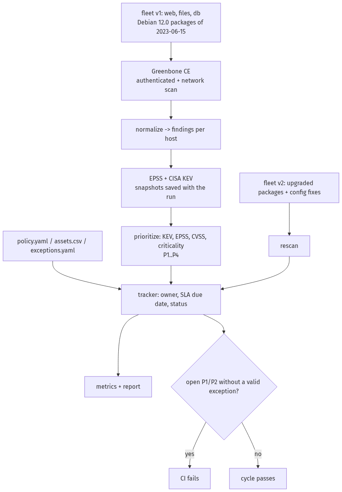

# Lab 09 — Vulnerability management workflow

Scan a small fleet of deliberately outdated lab hosts with Greenbone, prioritize every finding with CVSS + EPSS +
CISA KEV + asset criticality under a written policy, track remediation with SLA due dates, remediate, rescan and
report before/after metrics. One policy, one formula, and every number can be traced back to what the run saved.

**Status: completed.** Every result comes from GitHub Actions runs against containers; no real network is scanned.

## How it works



1. **Start** Greenbone Community Edition (scanner core, no web UI; software images pinned by digest, feed data images at their current version) and fleet **v1**:
   three Debian 12.0 containers whose packages come from the 2023-06-15 Debian snapshot. Once gvmd has loaded the
   vulnerability tests it is restarted, so its in-memory cache includes their CVE references.
2. **Scan** all three hosts in one Greenbone task ("Full and fast"): over the network and authenticated over SSH with
   a throwaway key, so the local security checks compare the installed packages against Debian advisories.
3. **Normalize** the XML report into findings per host. Log-only results and results with a quality of detection
   below 70 are skipped. A scan that did not finish, a host from the inventory missing from the report, stopped during
   the scan or without working authenticated checks, or package results without any CVE reference are errors
   (exit 2), never "0 findings".
4. **Enrich** the CVEs with FIRST EPSS scores and the CISA KEV catalog, fetched during the run and saved with their
   dates next to the reports.
5. **Prioritize** each finding P1–P4 (or informational) with the formula in
   [`docs/prioritization.md`](docs/prioritization.md); the rule that decided is stored with the row.
6. **Track**: one row per host and Greenbone check, with the asset's owner, the date found and the SLA due date.
7. **Remediate**: rebuild the hosts as fleet **v2** (current Debian 12 packages and security updates, plus the config
   fixes below) on the same addresses, and **rescan**.
8. **Update** the tracker (fixed, still open, new, risk accepted, reopened), write metrics and an HTML/Markdown
   report, and **gate**: the run fails if a P1 or P2 is open without a valid exception.

## Quick start (Linux, macOS or WSL with Docker)

```bash
python -m venv .venv && . .venv/bin/activate
pip install -r requirements.txt && pip install --no-deps -e .
eval "$(bash scripts/make-secrets.sh)"     # admin password for this run and a throwaway SSH key pair in out/keys/
bash scripts/run-cycle.sh                  # the whole cycle; the first start loads the Greenbone feed
# then open out/report.html (tracker: out/tracker.md, metrics: out/metrics.json)
```

`docker compose -f lab/compose.yaml down -v` removes the containers and volumes.

## The fleet

| Host | Address | Role | v1 packages | Criticality | Exposure | What v2 changes |
|---|---|---|---|---|---|---|
| `web` | 172.30.0.11 | web server | openssh-server, nginx (Debian snapshot 2023-06-15) | 3 | internet-facing | current packages; nginx stops advertising its version |
| `files` | 172.30.0.12 | file server (SFTP, FTP) | openssh-server, vsftpd (same snapshot) | 2 | internal | current packages; anonymous FTP off |
| `db` | 172.30.0.13 | database host | openssh-server, postgresql-15 (same snapshot) | 3 | internal | current packages |

Owners and criticality live in [`policy/assets.csv`](policy/assets.csv); the scan covers exactly that list.

## Policy

Details in [`docs/policy.md`](docs/policy.md); values in [`policy/policy.yaml`](policy/policy.yaml).

| Priority | SLA (days from the scan that found it) | Gates CI |
|---|---|---|
| P1 | 7 | yes |
| P2 | 30 | yes |
| P3 | 90 | no |
| P4 | 180 | no |
| informational (CVSS below 4.0, not in KEV, EPSS below 0.10) | — | no |

Exceptions (risk acceptances) live in [`policy/exceptions.yaml`](policy/exceptions.yaml): host, Greenbone check,
reason, approver role and expiry. An expired exception reopens the finding.

## Prioritization

First matching rule wins ([`docs/prioritization.md`](docs/prioritization.md) has worked examples):

| Rule | Priority |
|---|---|
| Any CVE of the finding is in CISA KEV | P1 |
| EPSS ≥ 0.10 and CVSS ≥ 7.0 | P1 |
| CVSS ≥ 9.0, or CVSS ≥ 7.0 on a criticality-3 or internet-facing asset | P2 |
| CVSS ≥ 7.0, or EPSS ≥ 0.10 | P3 |
| CVSS ≥ 4.0 | P4 |
| below 4.0 | informational |

## Tracker statuses

| Status | Meaning |
|---|---|
| `open` | found on the first scan and still present on the rescan |
| `fixed` | found on the first scan, absent on the rescan of the same host |
| `new` | present only on the rescan |
| `risk accepted` | covered by an exception that has not expired |
| `reopened` | covered by an exception that has expired |
| `info` | below the CVSS floor: tracked, never gating |

## CI and tests

| Job | What it proves |
|---|---|
| `lint` | ruff and mypy (strict) |
| `unit` | normalize, intel, prioritize, tracker, metrics, report, CLI and scan orchestration (against a fake GMP) on fixtures; coverage gate 90 % |
| `scan` | the whole cycle against Greenbone and the fleet; uploads both reports, the EPSS/KEV snapshots, the tracker, metrics and the HTML report; fails at the gate |
| `secrets` | gitleaks over the full history |

The cycle also runs weekly (the policy's frequency) and on demand. The `main` branch only accepts pull requests that
pass all four jobs.

## Limits

- Containers, not real hosts; no real network is scanned.
- The containers share the runner's kernel, so kernel findings (missing CPU-vulnerability mitigations) stay open after
  remediation: rebuilding an image cannot fix them.
- The Greenbone feed comes as data images, not a live sync, but Greenbone keeps only their current version: each run
  pulls the latest and records their digests in `out/feed-images.txt`, so runs on different days may use different
  tests. The SCAP and CERT
  feeds are not loaded: gvmd loads them before the vulnerability tests (about 38 minutes on a runner) and the
  findings do not need them (CVE references come from the vulnerability tests).
- EPSS and KEV are fetched on the run date, so a later run may prioritize the same finding differently. Each run saves
  the snapshots it used.
- Time to remediate is measured in minutes inside one run, not in days.
- The tracker is a CSV/Markdown file in the artifacts; there is no real ticketing system.
- Authenticated web-application scanning is out of scope.

## License

MIT — see [LICENSE](LICENSE).
